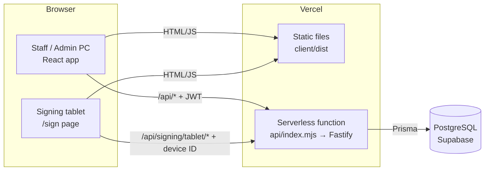
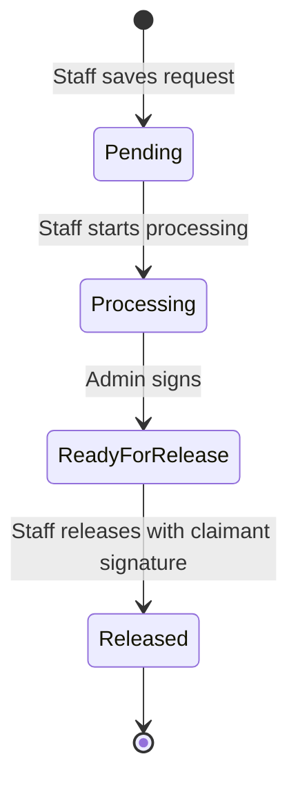
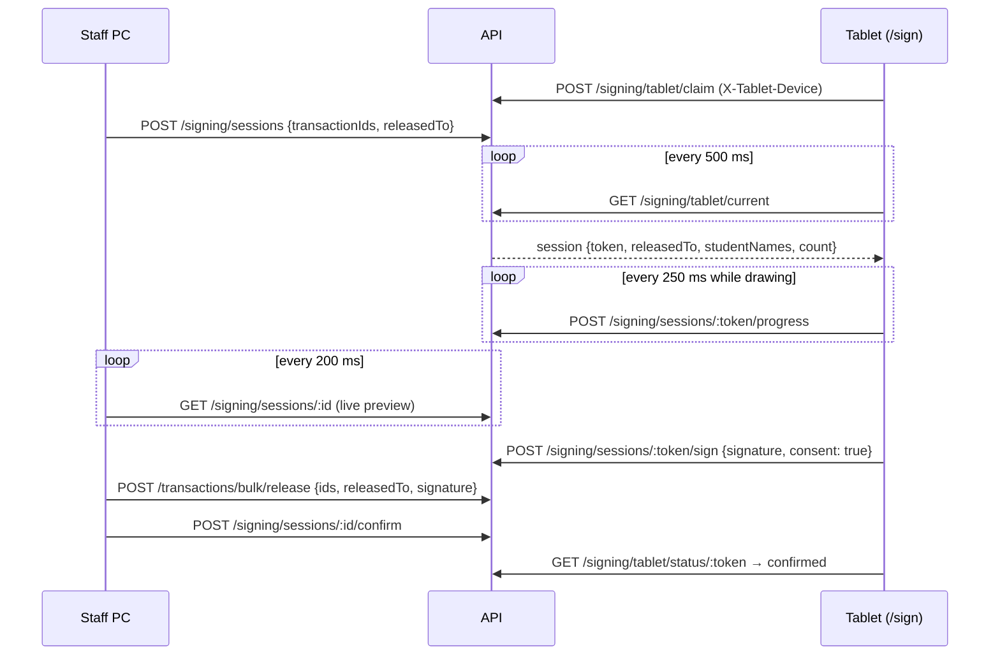

# RTAMS — Technical Design Document

**System:** Registrar Task Accomplishment Monitoring System (RTAMS), Bicol University Polangui
**Version:** 2.0 (covers the changes requested in [v2.md](v2.md))
**Last updated:** September 17, 2026

This document explains how RTAMS is built. It covers the architecture, the data model, the transaction workflow, the tablet signing mechanism, report generation and security. It is written for developers maintaining the system and for reviewers who need to understand the design decisions. For what the system does from a user's point of view, see [USER ROLES.md](USER%20ROLES.md). For setup, see [LOCAL_SETUP_GUIDE.md](LOCAL_SETUP_GUIDE.md) and [VERCEL_DEPLOYMENT_GUIDE.md](VERCEL_DEPLOYMENT_GUIDE.md).

---

## 1. Overview

The Registrar's Office records every document request: who asked for which documents, who prepared them, when the Registrar signed them, and who claimed them. RTAMS replaces the paper logbooks with a web application. It has three kinds of users:

| User | Device | What they do |
|---|---|---|
| Staff | Office PC | Encode requests, start processing, release documents |
| Admin (Registrar) | Office PC | Sign documents, view reports, manage staff and students |
| Claimant | Signing tablet (no login) | Signs to acknowledge receipt |

The two official logbooks the office submits, the **ARTA Logbook** and the **BUP Logbook**, are generated directly from the recorded transactions as Excel files.

## 2. Architecture



The code is an npm workspace in `rtms/` with three packages:

| Package | Purpose | Main technologies |
|---|---|---|
| `shared` (`@rtams/shared`) | Types, Zod validation schemas and constants used by both sides (document types, program aliases, date and duration helpers) | TypeScript, Zod |
| `server` (`@rtams/server`) | REST API and business logic | Fastify 4, Prisma 6, PostgreSQL, JWT, bcrypt, ExcelJS |
| `client` (`@rtams/client`) | Single-page app for staff, admin and the tablet | React 19, Vite, Tailwind CSS, Radix UI, react-signature-canvas |

**Deployment.** On Vercel, the client is served as static files and all `/api/*` requests are rewritten to one serverless function (`rtms/api/index.mjs`). That function builds the Fastify app once per warm instance and forwards each request with `fastify.inject()`. The response body is passed back as raw bytes (`rawPayload`) so binary downloads such as the Excel logbooks are not corrupted.

Because the server runs as short-lived serverless instances, **no state is kept in memory between requests**. Anything that must be shared, such as signing sessions, the tablet lock and staff activity, lives in the database. The one exception is a 10-second per-instance cache of the "is any staff active" check, which is safe to lose.

### 2.1 Server layout

```
server/src/
├── app.ts                 # buildApp(): registers plugins and routes
├── index.ts               # Local entry point (app.listen)
├── config/                # env.ts, db.ts (Prisma singleton)
├── middleware/            # authenticate (JWT), requireAdmin / requireStaff
├── routes/                # HTTP layer: validation and responses
│   ├── auth.routes.ts         # login, logout, heartbeat
│   ├── transaction.routes.ts  # single and bulk status changes
│   ├── signing.routes.ts      # tablet sessions and device lock
│   ├── student.routes.ts      # search, directory, create, import
│   ├── report.routes.ts       # JSON preview and xlsx exports
│   ├── audit.routes.ts
│   └── user.routes.ts
├── services/              # Business logic
│   ├── transaction.service.ts # status transitions
│   ├── report.service.ts      # ARTA/BUP row building
│   ├── audit.service.ts
│   └── auth.service.ts
└── utils/                 # jwt, password, doc-mapper, logbook-xlsx
```

### 2.2 Client layout

```
client/src/
├── App.tsx                # Routes: /login, /sign, /staff, /admin/*
├── components/
│   ├── layout/AppLayout.tsx          # Top bar, menu drawer, timeout, heartbeat
│   ├── transactions/                 # TransactionTable, dialogs, ResetTabletButton
│   ├── students/                     # Autocomplete, AddStudentDialog, BulkImportDialog
│   └── ui/                           # Button, Dialog, TopScrollContainer, ...
├── pages/                 # One component per screen
├── hooks/                 # useInactivityTimeout, useActivityHeartbeat, useStudentSearch
└── lib/                   # api (axios), auth context, date and format helpers
```

## 3. Data model

```mermaid
erDiagram
  User ||--o{ Transaction : "prepares"
  User ||--o{ Transaction : "reviews"
  User ||--o{ AuditLog : "performs"
  Student ||--o{ Transaction : "requests"
  Transaction ||--o{ AuditLog : "has"
  Transaction ||--o{ SigningSession : "signed via"
```



| Table | Key fields | Notes |
|---|---|---|
| `User` | `name`, `username`, `passwordHash`, `role` (`admin`/`staff`), `status`, `lastActiveAt` | `lastActiveAt` is the staff-activity signal used by the tablet. |
| `Student` | `studentNumber` (unique), names, `email` (BU email), `sex` (`M`/`F`), `contactNumber`, `course`, `yearLevel`, `active`, `isAlumni` | Alumni use `yearLevel = 0`. Manually added records without a student number get `MANUAL-<id>`. |
| `Transaction` | `studentId`, snapshot fields (`studentName`, `studentCourse`, `studentYearLevel`), `docCOR`, `docCOG`, `docGMC`, `docAUTH`, `docOTR`, `others`, `othersCount`, `status`, prepared/reviewed/released fields, `duration`, `signature` | Student details are copied at creation so later roster changes don't rewrite history. `signature` is a PNG data URL. |
| `AuditLog` | `transactionId`, `action`, `previousStatus`, `newStatus`, `performedBy`, `performedByName`, `timestamp` | One row per status change. |
| `SigningSession` | `transactionId`, `transactionIds[]`, `token`, `releasedTo`, `liveSignature`, `status`, `consentAt`, `completedAt` | One session can cover several transactions for one claimant. |
| `TabletLock` | `id` (always `"tablet"`), `deviceId`, `lastSeenAt` | Single row naming the one device allowed to sign. |

Document counts are stored as one integer column per type rather than JSON, which keeps the logbook totals simple to compute. The API exposes them as a `requestedDocuments` object (`{ COR, COG, GMC, AUTH, OTR }`); `utils/doc-mapper.ts` converts between the two shapes.

**Migrations** live in `server/prisma/migrations/`. The v2 migration (`20260917000000_v2_updates`) renames `docCMC` to `docGMC` with `RENAME COLUMN`, so existing counts are kept. It also adds the new student, user and signing columns and creates `TabletLock`.

## 4. Transaction workflow



All transitions go through one function, `transition()` in `transaction.service.ts`. It:

1. Loads every requested transaction inside a database transaction.
2. Rejects the whole request if any id is missing or not in the expected status, naming the affected students.
3. Updates each transaction and writes one audit row per transaction.

The single-item actions (`startProcessing`, `signTransaction`, `releaseTransaction`) call the bulk versions with one id, so both paths share the same rules. Signing also records the reviewer and computes `duration` (signed time minus prepared time).

| Action | Endpoint | Role | Change |
|---|---|---|---|
| Create | `POST /api/transactions` | any logged-in user | → Pending |
| Start processing | `POST /api/transactions/bulk/start` | staff | Pending → Processing |
| Sign | `POST /api/transactions/bulk/sign` | admin | Processing → Ready for Release |
| Release | `POST /api/transactions/bulk/release` | staff | Ready for Release → Released |

The older single-item `PATCH /api/transactions/:id/{start,sign,release}` routes still work.

### 4.1 Bulk actions in the UI

`TransactionTable` shows a checkbox on each row and a "select all" box. Selection is kept inside the table as a map from transaction id to the status it had when selected. When the dashboard refreshes (every 5 seconds), any row that disappeared or changed status is dropped from the selection, so the selection clears itself after a successful bulk action.

The bulk bar only offers actions that apply to the selected rows, and each action receives only the eligible rows. For example, "Start Processing (3)" sends only the Pending rows even if Released rows are also selected.

### 4.2 Per-day dashboards

Both dashboards always show a single day, which defaults to today:

- Staff choose Today, Yesterday or a custom date.
- Admin picks a date.

The table and the four stat cards use the same `startDate = endDate = <day>` filter. Each stat card is a `limit=1` query that only reads the `total`.

**Time zone.** Dates are Philippine calendar days (UTC+8) regardless of where the server runs. `phDayRange()` in `shared/constants.ts` converts `YYYY-MM-DD` into `[day 00:00 +08:00, next day 00:00 +08:00)`. Transaction lists, the audit log and reports all use it. On the client, `lib/date.ts` computes "today" with the `Asia/Manila` time zone.

## 5. Tablet signing

A claimant signs on a separate tablet that has no login. Staff start the signing from the Release dialog, and the tablet picks it up by polling.



**Session rules**

- Only one session can be open (`pending` or `signed`) at a time.
- A pending session expires after 10 minutes.
- Staff can cancel a session until they confirm it.
- One session can cover up to 200 Ready-for-Release transactions for the same claimant, which is how one block representative claims for the whole block. The signature is saved to all of them.

**Data Privacy consent.** The tablet shows a consent checkbox that refers to the Data Privacy Act of 2012 (RA 10173). The Done button stays disabled until it is ticked, and it resets for every session. The server also rejects a signature unless the request includes `consent: true`, and it stores the time in `SigningSession.consentAt`.

**Transparent signatures.** The signature pad has no background fill, so `toDataURL()` produces a PNG with a transparent background. This is what lets the BUP logbook show the signature like an e-signature. Do not add a `backgroundColor` to `SignaturePad`.

### 5.1 One device only

1. The tablet page creates a random device ID the first time it opens and keeps it in `localStorage`. It sends the ID in the `X-Tablet-Device` header on every tablet request.
2. `POST /api/signing/tablet/claim` gives the lock to this device in three cases:
   - no device holds it;
   - this device already holds it;
   - the holder hasn't been seen for 60 seconds.

   Otherwise it returns `423`. The claim uses a conditional `updateMany` followed by `createMany({ skipDuplicates: true })`, so two devices claiming at the same moment cannot both win.
3. Every tablet endpoint runs the `requireTabletDevice` guard. A request from any other device gets `423`. The guard also refreshes `lastSeenAt`, at most once every 10 seconds to limit database writes.
4. Staff or admin can press **Reset Tablet** (`DELETE /api/signing/tablet/lock`) to free the lock, for example when the tablet is replaced or its browser data was cleared.

In practice, while the sign page is open on one device, opening it on another shows "Tablet Already in Use". If the first device is closed, another device can take over after about a minute.

### 5.2 Only while staff are active

- While a staff or admin user is logged in and using the app, `useActivityHeartbeat` calls `POST /api/auth/heartbeat` once a minute, but only if there was mouse, keyboard or touch input in the last minute. The server stores the time in `User.lastActiveAt`.
- Logging in sets `lastActiveAt`, and logging out clears it.
- The heartbeat route is registered outside the login rate limit, because several office PCs may share one public IP.
- The tablet guard returns `503 no_active_staff` unless one of these is true:
  - an active **staff** account has `lastActiveAt` within the last 3 minutes;
  - a signing session opened in the last 10 minutes is still open. This covers staff who sit still while the claimant signs.
- The tablet then shows "Signing Unavailable" and retries every 3 seconds.

## 6. Students

- **Search** (`GET /api/students?q=`) returns up to 10 active students, including alumni, for the request form's autocomplete.
- **Directory** (`GET /api/students/directory`, admin only) returns active, non-alumni students with pagination (50 per page) and a `total`. It can be filtered by program alias (e.g. `course=BSIT`) and by a search term. This backs the "Enrolled Students" page.
- **Import** (`POST /api/students/bulk`) treats the uploaded file as the complete current roster, inside one database transaction:
  - students in the file are created or updated (and reactivated if needed);
  - non-alumni students missing from the file are marked inactive;
  - nothing is deleted.
  - Optional columns `Sex` (M/F, Male/Female) and `Contact Number` are accepted.
- **Programs** are stored by full name. `COURSE_ALIASES` in `shared/constants.ts` maps the short forms (BSIT, BSCS, …). `abbreviateCourse()` and `formatCourseYear()` produce the short labels shown in tables and the logbook (e.g. `BSIT-1`, `BSIT-Alumni`).
- **Alumni.** Staff add alumni with the **Alumni** button on the request form. The record is saved with `isAlumni = true` and `yearLevel = 0` and selected immediately.

## 7. Reports

`GET /api/reports?startDate&endDate&format=json|arta|bup` (admin only) reads **Released** transactions whose release date falls in the range (Philippine time), oldest first, together with the student's email, contact number and sex.

| Format | Output | Columns |
|---|---|---|
| `json` | On-screen preview | Same as ARTA |
| `arta` | `ARTA-Logbook-<start>-to-<end>.xlsx` | External Client Name, Requested Documents/Services, Contact Number, University Email Address, Date of Transaction (release date) |
| `bup` | `BUP-Logbook-<start>-to-<end>.xlsx` | Date, Name, Sex, Course & Year Level, Requested Documents/Services (COR, COG, GMC, AUTH, OTR, OTHERS), Received/Prepared By, Reviewed/Signed By, Duration of Process, Released To/Claimed By, Signature |

The workbooks are built by `utils/logbook-xlsx.ts` with ExcelJS:

- **Header band.** Row 1 of both files is merged across all columns and reads "COLLEGE/CAMPUS: BICOL UNIVERSITY POLANGUI" on an orange fill (`#F79646`).
- **Two-row header (BUP).** The first header row groups the six document columns under "Requested Documents/Services". The other headers span both rows.
- **Name columns (BUP).** The three "By" cells hold the name with the date and time on a second line.
- **OTHERS (BUP).** The OTHERS cell holds the count, and the free-text description is attached as a cell note.
- **Signatures (BUP).** Each claimant's PNG signature is placed as an image in the Signature column.
- **Totals (BUP).** A final **TOTAL** row sums each document column.

## 8. Security

| Concern | Measure |
|---|---|
| Passwords | bcrypt hashes |
| Sessions | JWT signed with `JWT_SECRET`, expires after 30 minutes; the client also logs out after 30 minutes without input. Production refuses to start with a weak or default secret. |
| Authorization | `authenticate` on all non-public routes; `requireAdmin` / `requireStaff` per route (e.g. only admin can sign, only staff can release) |
| Input validation | Zod schemas from `@rtams/shared` on every write |
| Brute force | Login is rate-limited to 10 requests per minute per IP when running as a normal server. This limit is in memory, so it does not apply on Vercel. |
| CORS | Only origins listed in `CORS_ORIGIN` |
| Tablet endpoints | No login, but limited to the device holding the lock and to times when staff are active; session tokens are 32 random bytes |
| Personal data | Consent is required and timestamped before a signature is stored |
| Audit | Every status change records who did it and when |

## 9. API reference

| Method | Endpoint | Access |
|---|---|---|
| POST | `/api/auth/login` | public (rate-limited) |
| POST | `/api/auth/logout` | public; clears activity if a valid token is sent |
| POST | `/api/auth/heartbeat` | logged in |
| GET | `/api/transactions` (`status`, `startDate`, `endDate`, `search`, `page`, `limit`) | logged in |
| GET | `/api/transactions/:id` | logged in |
| POST | `/api/transactions` | logged in |
| POST | `/api/transactions/bulk/start` | staff |
| POST | `/api/transactions/bulk/sign` | admin |
| POST | `/api/transactions/bulk/release` | staff |
| PATCH | `/api/transactions/:id/start` · `/sign` · `/release` | staff · admin · staff |
| GET | `/api/students?q=` | logged in |
| GET | `/api/students/directory` (`q`, `course`, `page`, `limit`) | admin |
| POST | `/api/students` | logged in |
| POST | `/api/students/bulk` | logged in |
| DELETE | `/api/students/:id` | admin (only students without transactions) |
| GET | `/api/reports` (`startDate`, `endDate`, `format`) | admin |
| GET | `/api/audit-logs` (`startDate`, `endDate`, `page`, `limit`) | admin |
| GET · POST · PATCH | `/api/users`, `/api/users/:id`, `/api/users/:id/reset-password` | admin |
| POST | `/api/signing/sessions` | staff |
| GET · DELETE | `/api/signing/sessions/:id` | staff |
| POST | `/api/signing/sessions/:id/confirm` | staff |
| DELETE | `/api/signing/tablet/lock` | logged in |
| POST | `/api/signing/tablet/claim` | tablet (device ID header) |
| GET | `/api/signing/tablet/current` | registered tablet |
| POST | `/api/signing/sessions/:token/progress` · `/sign` | registered tablet |
| GET | `/api/signing/tablet/status/:token` | registered tablet |

## 10. Configuration

| Variable | Purpose |
|---|---|
| `DATABASE_URL` | Pooled connection string (add `pgbouncer=true` for the Supabase pooler) |
| `DIRECT_URL` | Direct connection used by Prisma migrations |
| `JWT_SECRET` | Token signing secret (32+ characters in production) |
| `PORT` | Local server port (default 3001) |
| `CORS_ORIGIN` | Comma-separated allowed origins |
| `NODE_ENV` | `production` enables the secret check |

The timing values are constants in `signing.routes.ts`:

| Constant | Value | Meaning |
|---|---|---|
| `SESSION_TIMEOUT_MS` | 10 min | Pending session lifetime |
| `LOCK_STALE_MS` | 60 s | How long before another device can take over the tablet |
| `STAFF_ACTIVE_MS` | 3 min | How recent a staff heartbeat must be |

## 11. Verification

There is no automated test suite yet. The v2 changes were checked as follows:

- `npm run build` type-checks and builds all three packages.
- All migrations were applied to an empty PostgreSQL-compatible database. `prisma migrate diff` against `schema.prisma` reported no differences.
- An end-to-end API script ran 34 checks through `fastify.inject()`:
  - tablet lock and staff-activity rules;
  - consent enforcement;
  - student and alumni creation;
  - roster import that leaves alumni active;
  - directory filters;
  - bulk start, sign and release with role checks;
  - audit counts;
  - both xlsx downloads.
- Generated ARTA and BUP files were inspected for merged headers, the orange fill, embedded images and correct totals.

**Recommended manual checks after deployment**

- Open `/sign` on two devices.
- Release a block of requests to one claimant.
- Download both logbooks from the deployed site and open them in Excel.

## 12. Known limitations and future work

- **Polling.** The staff release dialog polls every 200 ms and the tablet every 250–500 ms. That is simple and works on serverless, but it produces many small requests. Server-sent events or Supabase Realtime would reduce the load.
- **No login rate limit on Vercel.** The login limit only applies when the API runs as a normal server. A shared store such as Redis would be needed to enforce it on Vercel.
- **One signing tablet.** The lock is a single row. Supporting several counters would mean one lock row per counter, with sessions assigned to a counter.
- **Page size.** The dashboards load up to 50 transactions for the selected day. Busier days would need pagination in the table.
- **No automated tests.** The verification script used for v2 could be turned into a permanent integration test suite.
